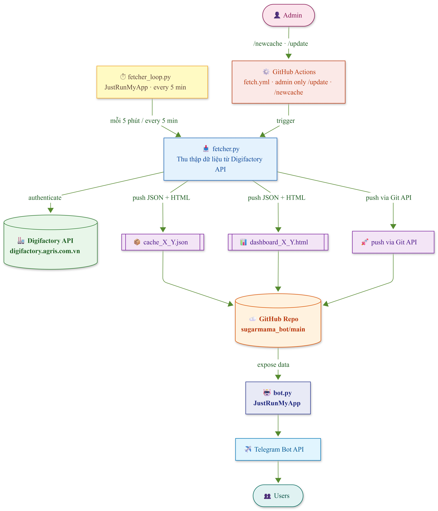

# 🍬 SugarMama Bot

**Telegram bot giám sát chất lượng dây chuyền sản xuất đường mía theo thời gian thực.**

*Real-time sugarcane production quality monitoring Telegram bot.*

---

## Mục lục / Table of Contents

- [Tổng quan / Overview](#tổng-quan--overview)
- [Kiến trúc hệ thống / Architecture](#kiến-trúc-hệ-thống--architecture)
- [Cài đặt & Deploy / Setup & Deploy](#cài-đặt--deploy--setup--deploy)
- [Danh sách lệnh / Command Reference](#danh-sách-lệnh--command-reference)
- [Cú pháp ngày / Date Syntax](#cú-pháp-ngày--date-syntax)
- [Quyền truy cập / Access Control](#quyền-truy-cập--access-control)
- [Dashboard HTML](#dashboard-html)
- [Cấu trúc dữ liệu / Data Structure](#cấu-trúc-dữ-liệu--data-structure)

---

## Tổng quan / Overview

**VI:** SugarMama Bot kết nối với hệ thống Digifactory để thu thập số liệu phân tích chất lượng (Bx, Pol, Ap, pH, Độ màu...) từ các công đoạn sản xuất — Mía, Làm sạch (Hoa), Nấu đường (Nau), Mật rỉ & Bùn thô — rồi trả kết quả trực tiếp qua Telegram với so sánh ngưỡng chuẩn.

**EN:** SugarMama Bot connects to Digifactory to collect quality analysis metrics (Bx, Pol, Ap, pH, Color...) across production stages — Sugarcane, Clarification (Hoa), Crystallization (Nau), Molasses & Mud — and delivers results directly via Telegram with threshold comparison.

---

## Kiến trúc hệ thống / Architecture



**VI:** Toàn bộ hệ thống không cần server riêng — chạy hoàn toàn trên JustRunMyApp (free tier) và GitHub (free public repo).

**EN:** The entire system requires no dedicated server — runs entirely on JustRunMyApp (free tier) and GitHub (free public repo).

---

## Cài đặt & Deploy / Setup & Deploy

### Yêu cầu / Requirements

| Thành phần / Component | Mô tả / Description |
|---|---|
| Python 3.11+ | Runtime |
| `python-telegram-bot >= 20.0` | Telegram API wrapper |
| `requests` | HTTP client |
| JustRunMyApp | Hosting cho `bot.py` và `fetcher_loop.py` / Hosting for `bot.py` and `fetcher_loop.py` |
| GitHub repo (public) | Lưu trữ cache và dashboard / Cache and dashboard storage |
| GitHub repo `sugarmama_config` | Lưu danh sách user / User list storage |

### Biến môi trường / Environment Variables

| Biến / Variable | Mô tả / Description | Bắt buộc / Required |
|---|---|---|
| `BOT_TOKEN` | Telegram Bot Token từ @BotFather | ✅ |
| `ALLOWED_CHAT_ID` | Chat ID của admin | ✅ |
| `PAT` | GitHub Personal Access Token (quyền `repo`) | ✅ |
| `BOT_TOKEN` | *(bot.py)* Telegram Bot Token | ✅ |
| `DIGIFACTORY_USERNAME` | Tài khoản Digifactory | ✅ (fetcher) |
| `DIGIFACTORY_PASSWORD` | Mật khẩu Digifactory | ✅ (fetcher) |

### Cấu trúc file / File Structure

```
sugarmama_bot/
├── fetcher.py              # Thu thập dữ liệu & build dashboard
├── fetcher_loop.py         # Vòng lặp 5 phút, push lên GitHub
├── bot.py                  # Telegram bot
├── dashboard_template.html # Template dashboard HTML
├── .github/
│   └── workflows/
│       └── fetch.yml       # GitHub Actions workflow
├── cache_YYYY-MM-DD_YYYY-MM-DD.json    # Cache dữ liệu (auto-generated)
└── dashboard_YYYY-MM-DD_YYYY-MM-DD.html # Dashboard (auto-generated)

sugarmama_config/
└── users.json              # Danh sách user được phép / Approved user list
```

---

## Danh sách lệnh / Command Reference

### Lệnh chung / General Commands

| Lệnh / Command | Mô tả (VI) | Description (EN) |
|---|---|---|
| `/start` | Đăng ký truy cập, gửi yêu cầu đến admin | Register access, send request to admin |
| `/help` | Hiển thị danh sách lệnh và cú pháp | Show command list and syntax |
| `/status` | Trạng thái bot, thời gian cập nhật data, khoảng dữ liệu | Bot status, last data update, data range |
| `/summary [ngày]` | Tóm tắt tất cả thông số theo ngày | Summary of all parameters by date |
| `/dashboard [ngày]` | Tải file Dashboard HTML tương tác | Download interactive HTML Dashboard |

### Lệnh chỉ Admin / Admin-only Commands

| Lệnh / Command | Mô tả (VI) | Description (EN) |
|---|---|---|
| `/update` | Trigger GitHub Actions fetch dữ liệu ngay | Trigger GitHub Actions to fetch data immediately |
| `/newcache DD/MM/YYYY - DD/MM/YYYY` | Fetch lại dữ liệu cho khoảng ngày cụ thể | Re-fetch data for a specific date range |
| `/remove_user <chat_id>` | Thu hồi quyền truy cập của một user | Revoke a user's access |

### Lệnh thông số — Mía / Sugarcane Commands

| Lệnh / Command | Thông số / Parameter |
|---|---|
| `/pol_ba` | Pol bã mía |
| `/am_ba` | Độ ẩm bã mía |
| `/xo_mia` | Xơ mía |
| `/p2o5` | Hàm lượng P2O5 |
| `/ph_nmgv` | pH Nước mía gia vôi |
| `/ph_nmth` | pH Nước mía trung hòa |
| `/ap_nmhh` `/bx_nmhh` `/pol_nmhh` | Ap / Bx / Pol NM hỗn hợp |
| `/ap_nmdau` `/bx_nmdau` `/pol_nmdau` | Ap / Bx / Pol NM đầu |
| `/ap_nmcuoi` `/bx_nmcuoi` `/pol_nmcuoi` | Ap / Bx / Pol NM cuối |

### Lệnh thông số — Làm sạch / Clarification Commands

| Lệnh / Command | Thông số / Parameter |
|---|---|
| `/ap_nct2` `/bx_nct2` `/pol_nct2` `/ph_nct2` | Ap / Bx / Pol / pH Nước chè trong 2 |
| `/duc_nct2` `/mau_nct2` | Độ đục / Độ màu NCT2 |
| `/ap_syrup_s` `/bx_syrup_s` `/pol_syrup_s` `/ph_syrup_s` `/mau_syrup_s` | Syrup sau lắng nổi |
| `/ap_syrup_t` `/bx_syrup_t` `/pol_syrup_t` `/ph_syrup_t` `/mau_syrup_t` | Syrup trước lắng nổi |
| `/ap_siro` `/bx_siro` `/pol_siro` `/ph_siro` `/mau_siro` | Sirô thô sau bốc hơi |

### Lệnh thông số — Nấu đường / Crystallization Commands

| Lệnh / Command | Thông số / Parameter |
|---|---|
| `/ap_nona` `/bx_nona` `/pol_nona` | Ap / Bx / Pol Đường non A |
| `/ap_nonb` `/bx_nonb` `/pol_nonb` | Ap / Bx / Pol Đường non B |
| `/ap_nonc` `/bx_nonc` `/pol_nonc` | Ap / Bx / Pol Đường non C |
| `/ap_dgb` `/bx_dgb` `/pol_dgb` | Ap / Bx / Pol Đường B |
| `/ap_dgc` `/bx_dgc` `/pol_dgc` | Ap / Bx / Pol Đường C |
| `/ap_mna` `/bx_mna` `/pol_mna` | Ap / Bx / Pol Mật nguyên A |
| `/ap_mla` `/bx_mla` `/pol_mla` | Ap / Bx / Pol Mật loãng A |
| `/ap_mb` `/bx_mb` `/pol_mb` | Ap / Bx / Pol Mật B |
| `/ap_hdb` `/bx_hdb` `/pol_hdb` `/mau_hdb` | Ap / Bx / Pol / Độ màu Hồi dung B |
| `/ap_hdc` `/bx_hdc` `/pol_hdc` `/mau_hdc` | Ap / Bx / Pol / Độ màu Hồi dung C |

### Lệnh thông số — Mật rỉ & Bùn thô / Molasses & Mud Commands

| Lệnh / Command | Thông số / Parameter |
|---|---|
| `/pol_bun` `/am_bun` | Pol / Độ ẩm bùn thô |
| `/ap_mc` `/bx_mc` `/pol_mc` `/rs_mc` | Ap / Bx / Pol / RS mật cuối |
| `/ap_mr` `/bx_mr` `/bx1_mr` `/pol_mr` | Ap / Bx / Bx1 / Pol mật rỉ |

---

## Cú pháp ngày / Date Syntax

**VI:** Tất cả lệnh thông số và `/summary` đều chấp nhận tham số ngày tuỳ chọn. Mặc định trả 7 ngày mới nhất có dữ liệu.

**EN:** All indicator commands and `/summary` accept an optional date argument. Default returns the latest 7 days with data.

| Cú pháp / Syntax | Ví dụ / Example | Mô tả / Description |
|---|---|---|
| *(không có / none)* | `/bx_nona` | 7 ngày mới nhất / Latest 7 days |
| `DD/MM` | `/bx_nona 15/01` | Ngày cụ thể (năm hiện tại) / Specific date (current year) |
| `DD/MM/YYYY` | `/bx_nona 15/01/2025` | Ngày cụ thể đầy đủ / Full specific date |
| `DD/MM-DD/MM` | `/bx_nona 01/01-15/01` | Khoảng ngày / Date range |
| `DD/MM/YYYY - DD/MM/YYYY` | `/summary 01/01/2025 - 31/01/2025` | Khoảng ngày đầy đủ / Full date range |

---

## Quyền truy cập / Access Control

**VI:**

- **Admin** (`ALLOWED_CHAT_ID`): toàn quyền, bao gồm phê duyệt user và các lệnh quản trị.
- **User được duyệt**: truy cập tất cả lệnh thông số, `/summary`, `/status`, `/help`, `/dashboard`.
- **User chưa duyệt**: chỉ dùng được `/start` để gửi yêu cầu đến admin.

Luồng xét duyệt:
1. User gõ `/start`
2. Admin nhận thông báo với nút **Approve / Deny**
3. Sau khi approve, user được lưu vào `sugarmama_config/users.json` trên GitHub — danh sách này tồn tại vĩnh viễn kể cả khi bot restart.

**EN:**

- **Admin** (`ALLOWED_CHAT_ID`): full access, including user approval and admin commands.
- **Approved users**: access to all indicator commands, `/summary`, `/status`, `/help`, `/dashboard`.
- **Unapproved users**: `/start` only, to request access from admin.

Approval flow:
1. User sends `/start`
2. Admin receives notification with **Approve / Deny** buttons
3. Upon approval, user is saved to `sugarmama_config/users.json` on GitHub — persistent across bot restarts.

---

## Dashboard HTML

**VI:** `/dashboard` gửi file `.html` tương tác qua Telegram. File có thể mở offline (data đã embed sẵn) hoặc tự động cập nhật data mới nhất từ GitHub khi có kết nối internet.

**EN:** `/dashboard` sends an interactive `.html` file via Telegram. The file can be opened offline (data is embedded) or automatically refreshes from GitHub when internet is available.

**Tính năng dashboard / Dashboard features:**

- 10 tab phân loại theo công đoạn sản xuất / 10 tabs organized by production stage
- Biểu đồ đường với đường ngưỡng chuẩn (cận trên/dưới) / Line charts with threshold lines (upper/lower bounds)
- Bộ lọc ngày (from/to) / Date range filter
- Zoom in bằng scroll chuột, kéo để pan, double-click để reset / Scroll to zoom in, drag to pan, double-click to reset
- Bảng tổng hợp với % lệch ngưỡng và độ lệch chuẩn (σ) / Summary table with breach % and standard deviation (σ)
- Xuất CSV/Excel / Export to CSV/Excel
- Chip trạng thái Live/Offline / Live/Offline status chip
- Auto-refresh mỗi 5 phút khi online / Auto-refresh every 5 minutes when online

---

## Cấu trúc dữ liệu / Data Structure

**VI:** `cache_YYYY-MM-DD_YYYY-MM-DD.json` lưu toàn bộ số liệu thô theo cấu trúc:

**EN:** `cache_YYYY-MM-DD_YYYY-MM-DD.json` stores all raw data with the structure:

```json
{
  "from_date": "2025-01-01",
  "to_date":   "2025-04-30",
  "updated_at": "2025-04-30 14:32:00",
  "raw": {
    "mia": {
      "Pol bã":  [{"t": "2025-01-01 07:00", "v": 1.42}, ...],
      "Ẩm bã":   [{"t": "2025-01-01 07:00", "v": 49.8}, ...]
    },
    "hoa": {
      "Nước chè trong 2": {
        "Ap":  [{"t": "2025-01-01 07:00", "v": 12.3}, ...],
        "Bx":  [{"t": "2025-01-01 07:00", "v": 13.1}, ...]
      }
    },
    "nau": { ... },
    "mat": { ... }
  }
}
```

---

## Ngưỡng chuẩn / Quality Thresholds

**VI:** Các ngưỡng được định nghĩa cứng trong `bot.py` và `fetcher.py`. Dashboard hiển thị đường ngưỡng trên biểu đồ và tô màu đỏ các điểm vượt ngưỡng.

**EN:** Thresholds are hard-coded in `bot.py` and `fetcher.py`. The dashboard renders threshold lines on charts and highlights out-of-range points in red.

| Công đoạn / Stage | Thông số / Parameter | Cận dưới / Lower | Cận trên / Upper |
|---|---|---|---|
| Nước chè trong 2 | Độ đục (IU) | 0 | 18 |
| Nước chè trong 2 | pH | 7.2 | 7.3 |
| Syrup trước lắng nổi | Bx | 58 | 62 |
| Đường non A | Ap | 80 | 83 |
| Đường non A | Bx | 92.5 | 93 |
| Mía - Nước mía | Pol bã | 0 | 1.75 |
| Mía - Nước mía | Ẩm bã | 48 | 52 |
| Mía - Nước mía | P2O5 | 350 | 400 |
| Mật rỉ | Bx1 mật rỉ | 80 | 82 |
| *(và nhiều thông số khác...)* | | | |

---

## Ghi chú vận hành / Operational Notes

**VI:**
- `fetcher_loop.py` chạy 24/7 trên JustRunMyApp, gọi `fetcher.py` mỗi 5 phút.
- Nếu fetch thất bại liên tiếp 3 lần → bot Telegram gửi cảnh báo về admin.
- Nếu push GitHub thất bại → bot gửi cảnh báo riêng biệt (phân biệt với lỗi fetch).
- `heartbeat.json` được ghi sau mỗi cycle để monitor trạng thái loop.
- JustRunMyApp cần restart thủ công định kỳ (admin nhận nhắc nhở trong `/status`).

**EN:**
- `fetcher_loop.py` runs 24/7 on JustRunMyApp, calling `fetcher.py` every 5 minutes.
- If fetch fails 3 consecutive times → Telegram alert sent to admin.
- If GitHub push fails → separate alert sent (distinct from fetch errors).
- `heartbeat.json` is written after each cycle for loop health monitoring.
- JustRunMyApp requires manual periodic restart (admin reminded via `/status`).

---

*Maintained by [@minht3902](https://github.com/minht3902)*
